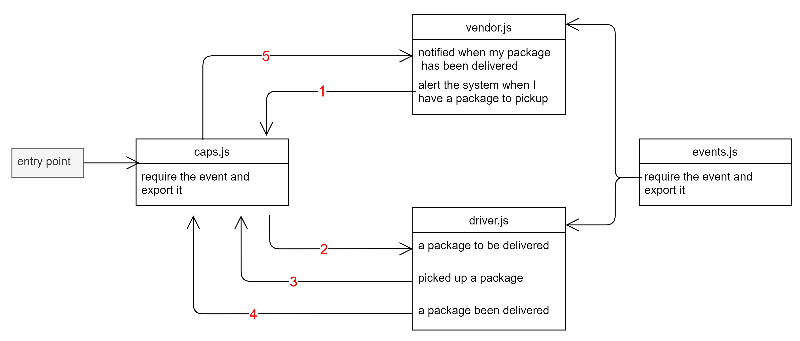
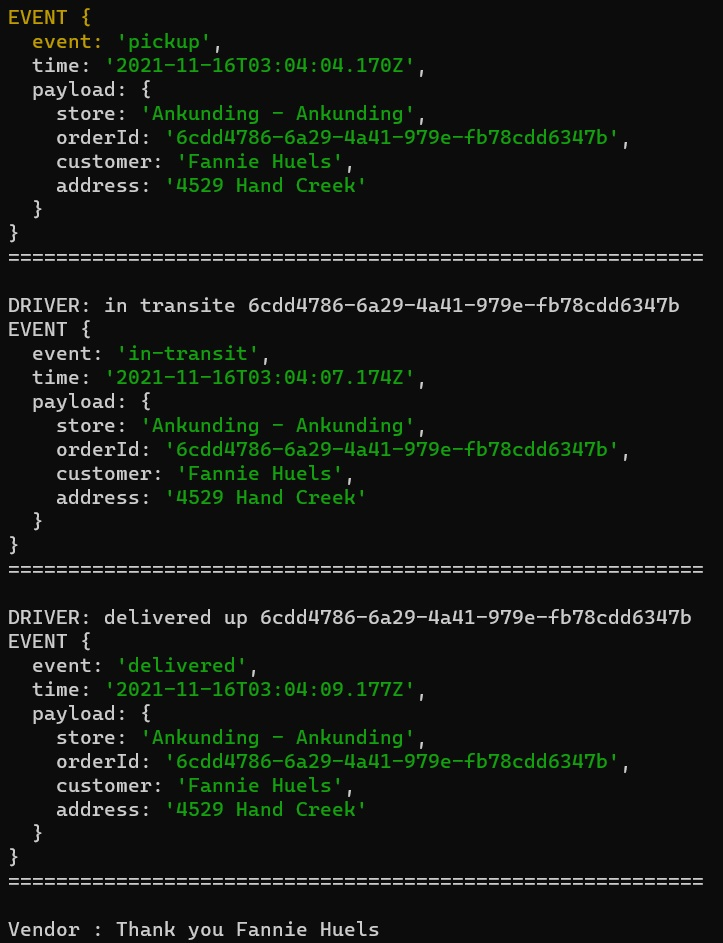
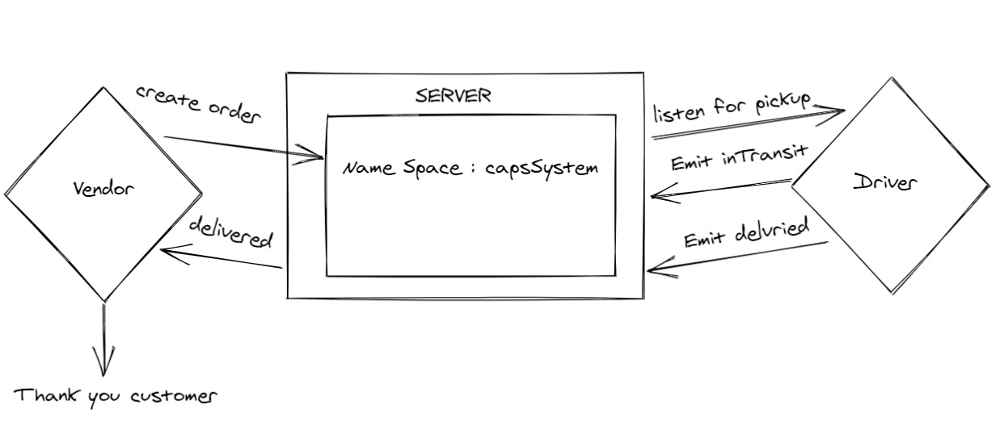

# caps

**Author : Khalid Hamedi**

**description**

**build out a system that emulates a real world supply chain. CAPS will simulate a delivery service where vendors (such a flower shops) will ship products using our delivery service and when our drivers deliver them, be notified that their customers received what they purchased.**

**Tactically, this will be an event driven application that “distributes” the responsibility for logging to separate modules, using only events to trigger logging based on activity.**

## Phase 1

setup a system of events and handlers, with the intent being to change out the eventing system as we go, and keeping the handlers themselves largely the same.

## CAPS system

- events.js - Global Event Pool caps.js - Main Hub Application Manages the state of every package Logs every event to the console with a timestamp and the event payload

- vendor.js - Vendor Module Every 5 seconds, simulate a new customer order

- Monitor the system for events … Whenever the ‘delivered’ event occurs “thank you” logged to the console

- driver.js - Drivers Module Monitor the system for events … On the ‘pickup’ event … Wait 1 second Log “DRIVER: picked up [ORDER_ID]” to the console. Emit an ‘in-transit’ event with the payload you received Wait 3 seconds Log “delivered” to the console Emit a ‘delivered’ event with the same payload

## UML

## Links

[Actions](https://github.com/khalidsy90/caps/actions)
[Branch Events](https://github.com/khalidsy90/caps/tree/events)
[Branch Sockeit.io](https://github.com/khalidsy90/caps/tree/sockitIo)

---

console output :

---

# Socket.io

**A real-time service that allows for vendors, such as flower shops or restaurants, to alert a system of a package needing to be delivered, for drivers to instantly see what’s in their pickup queue, and then to alert the vendors as to the state of the deliveries (in transit, and then delivered)**

### UML

### SetUp :

- **npm i dotenv faker jest npm i socket.io socket.io-client**
- **Start the server using node hub.js , node modules/vendor.js , node modules/driver.js by splitting the terminal window to three parts or open 3 terminal windows and run each commapn on a different part to see the connection between the servers**

### test

